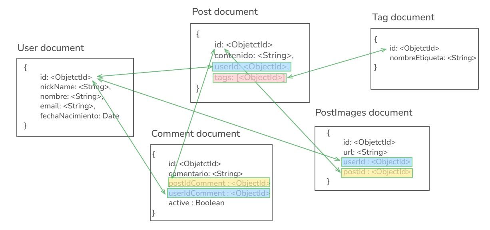

# 💥 Anti-Social Relational - Los Crudos

Proyecto desarrollado por el grupo **Los Crudos** para la materia *Construcción de Interfaces de Usuario*.  
Se trata de una aplicación web que explora interacciones sociales digitales de manera crítica y creativa.

---

## 🎯 Descripción

**Anti-Social Relational** es una interfaz experimental que simula una red social con un enfoque irónico sobre la conectividad digital y las relaciones interpersonales. Su diseño busca ser provocador, funcional y visualmente impactante.

—


## 🚀 Funcionalidades Principales

- 🧩 Interfaz RESTful conectada a MongoDB
- 🧵 Feed dinámico con publicaciones generadas
- 📄 Documentación con Swagger (`swagger.yaml`)
- 🎭 Enfoque anti-convencional en la experiencia de usuario
- 💅 Estética disruptiva con diseño propio

---

## 🛠️ Tecnologías Utilizadas

- **Node.js**
- **Express** `^5.1.0`
- **MongoDB** con **Mongoose** `^8.3.4`
- **Joi** `^17.13.3`
- **Swagger UI Express** `^5.2.3`
- **Redis** (cache y persistencia en memoria)
- **redis** (cliente Node.js para conectarse a Redis)
- **Docker** (contenedorización de la aplicación)
- **Docker Compose** (para orquestar Mongo, Redis y el backend)
- **Nodemon** (desarrollo) `^3.1.10`

## 🧪 Ejecución con Docker

1. Asegurate de tener Docker y Docker Compose instalados.

2. En la raíz del proyecto, ejecutar:

```bash
docker compose up --build

---
##ENDPOINTS

Los endpoints pueden ser visualizados Swagger incluido en el proyecto

##Colecciones POSTMAN

Estos se encuentran en la carpeta src/data del proyecto


## 📦 Instalación

1. Clonar el repositorio:

```bash
git clone https://github.com/tu_usuario/anti-social-mongo-los-crudos.git
cd anti-social-mongo-los-crudos

2.Instalar dependencias:


npm install


3.Ejecutar el servidor de desarrollo: npm run dev

4.Abrir el navegador en:
"http://localhost:4000" o entorno de ejecución designado


Estructura del proyecto:

anti-social-mongo-los-crudos/
├── assets/
├── src/
│   ├── controllers/
│   ├── data/                  
│   ├── db/                    
│   ├── middlewares/
│   ├── models/                
│   ├── routes/
│   ├── schemas/               
│   └── main.js
├── .ENV
├── docker-compose.yml
├── swagger.yaml
├── package.json
├── package-lock.json
└── README.md


